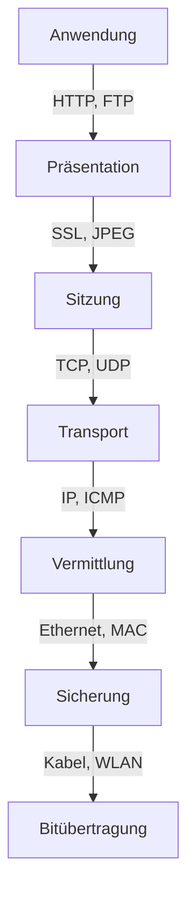
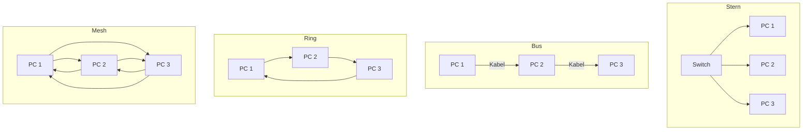

# 📚 Tag 1: Einführung & Netzwerkgrundlagen

## **📖 Theorie**

---

### **1. Einführung: Was ist ein Netzwerk?**

Ein **Netzwerk** ist ein System aus **Knoten** (z. B. Computer, Server, Router) und **Verbindungen** (z. B. Kabel, Funk), die den **Austausch von Daten** ermöglichen.

#### **Arten von Netzwerken**

| **Typ**  | **Beschreibung**                                          | **Beispiel**                                  |
| -------- | --------------------------------------------------------- | --------------------------------------------- |
| **LAN**  | Lokales Netzwerk (begrenzter Bereich, z. B. Büro, Schule) | Ethernet, WLAN zu Hause                       |
| **WAN**  | Weitverbindungsnetzwerk (große geografische Gebiete)      | Internet                                      |
| **WLAN** | Drahtloses LAN (Funkverbindung)                           | Router mit Wi-Fi                              |
| **MAN**  | Metropolitan Area Network (Stadtgebiet)                   | Stadtweites Netzwerk für Behörden             |
| **PAN**  | Personal Area Network (geringer Radius, z. B. Bluetooth)  | Verbindung zwischen Smartphone und Kopfhörern |

#### **Warum sind Netzwerke wichtig?**

- **Daten austauschen** (z. B. Dateien, E-Mails)
- **Ressourcen teilen** (z. B. Drucker, Server)
- **Kommunikation** (z. B. VoIP, Chat)
- **Zentralisierte Verwaltung** (z. B. Benutzerverwaltung, Backups)

---

---

### **2. Entstehung und Geschichte von Netzwerken**

#### **Meilensteine**

- **1960er:** ARPANET (Vorläufer des Internets, USA)
- **1970er:** Ethernet (Xerox), TCP/IP-Protokoll
- **1980er:** ISO/OSI-Referenzmodell, erste kommerzielle Netzwerke
- **1990er:** World Wide Web (WWW), Breitband-Internet
- **2000er:** WLAN (802.11), Cloud Computing
- **2010er–heute:** IoT, 5G, Software-Defined Networking (SDN)

#### **Aktuelle Trends**

- **Cloud-Netzwerke** (AWS, Azure)
- **Edge Computing** (Datenverarbeitung am Rand des Netzwerks)
- **KI in Netzwerken** (z. B. automatisierte Fehlererkennung)

---

---

### **3. OSI-Referenzmodell**

Das **OSI-Modell** (Open Systems Interconnection) ist ein **7-Schichten-Modell**, das die Kommunikation in Netzwerken standardisiert.

#### **Die 7 Schichten im Überblick**

| **Schicht** | **Name**                   | **Aufgabe**                                                 | **Beispiele/Protokolle**       |
| ----------- | -------------------------- | ----------------------------------------------------------- | ------------------------------ |
| **7**       | Anwendung (Application)    | Benutzerschnittstelle, Anwendungsdienste                    | HTTP, FTP, SMTP, DNS           |
| **6**       | Darstellung (Presentation) | Datenformatierung (Verschlüsselung, Komprimierung)          | SSL/TLS, JPEG, MPEG            |
| **5**       | Sitzung (Session)          | Verbindung zwischen Anwendungen herstellen/verwalten        | NetBIOS, RPC                   |
| **4**       | Transport (Transport)      | Ende-zu-Ende-Kommunikation, Fehlererkennung, Flusskontrolle | TCP, UDP                       |
| **3**       | Vermittlung (Network)      | Logische Adressierung (IP), Routing                         | IP, ICMP, Router               |
| **2**       | Sicherung (Data Link)      | Physikalische Adressierung (MAC), Fehlererkennung in Frames | Ethernet, Switch, MAC-Adressen |
| **1**       | Bitübertragung (Physical)  | Übertragung von Rohdaten (Bits) über physikalische Medien   | Kabel (UTP, Glasfaser), WLAN   |

#### **Merksatz für die Schichten**

**"All People Seem To Need Data Processing"**  
(Anwendung, Präsentation, Sitzung, Transport, Vermittlung, Sicherung, Bitübertragung)

#### **Visualisierung des OSI-Modells**

#### **Praktische Relevanz**

- **Fehleranalyse:** Wenn z. B. eine Webseite nicht lädt, kann das Problem in **Schicht 7 (HTTP)** oder **Schicht 3 (IP-Routing)** liegen.
- **Protokoll-Stack:** Jede Schicht fügt **Header** hinzu (z. B. IP-Header in Schicht 3, TCP-Header in Schicht 4).

---

---

### **4. Netzwerktopologien**

Eine **Topologie** beschreibt die **Anordnung der Knoten und Verbindungen** in einem Netzwerk.

#### **Übersicht der Topologien**

| **Topologie** | **Beschreibung**                                                              | **Vorteile**                          | **Nachteile**                               | **Einsatzbeispiel**              |
| ------------- | ----------------------------------------------------------------------------- | ------------------------------------- | ------------------------------------------- | -------------------------------- |
| **Stern**     | Alle Knoten sind mit einem zentralen Knoten (z. B. Switch) verbunden.         | Einfache Verwaltung, hohe Performance | Single Point of Failure (zentraler Knoten)  | Büro-Netzwerke                   |
| **Bus**       | Alle Knoten sind an ein gemeinsames Kabel angeschlossen.                      | Geringer Verkabelungsaufwand          | Kollisionsanfälligkeit, schwer zu erweitern | Ältere Ethernet-Netzwerke        |
| **Ring**      | Jeder Knoten ist mit zwei Nachbarn verbunden (Ringstruktur).                  | Kein Single Point of Failure          | Komplexe Fehlerbehebung                     | Token Ring (z. B. IBM-Netzwerke) |
| **Mesh**      | Jeder Knoten ist mit jedem anderen verbunden (voll vermascht) oder teilweise. | Hohe Ausfallsicherheit                | Hoher Verkabelungsaufwand                   | Büro (aktuell auch immer mehr private Haushalte)           |
| **Hybrid**    | Kombination aus mehreren Topologien (z. B. Stern + Ring).                     | Flexibel, skalierbar                  | Komplexe Verwaltung                         | Große Unternehmensnetzwerke      |

#### **Visualisierung der Topologien**

---

---

## **💡 Übungsaufgaben**

---

### **📝 Aufgabe 1: OSI-Modell – Schichten zuordnen**

**Beschreibung:**  
Ordne die folgenden **Protokolle und Komponenten** den richtigen **OSI-Schichten** zu.

| **Protokoll/Komponente** | **OSI-Schicht** |
| ------------------------ | --------------- |
| HTTP                     | ?               |
| TCP                      | ?               |
| Ethernet                 | ?               |
| IP                       | ?               |
| MAC-Adresse              | ?               |
| Router                   | ?               |
| Switch                   | ?               |

Hier gibst auch nochmal was zum nachschlagen! [OSI Modell WIki](https://de.wikipedia.org/wiki/OSI-Modell)

??? success "Lösung:"
    | **Protokoll/Komponente** | **OSI-Schicht**  |
    | ------------------------ | ---------------- |
    | HTTP                     | 7 (Anwendung)    |
    | TCP                      | 4 (Transport)    |
    | Ethernet                 | 2 (Sicherung)    |
    | IP                       | 3 (Vermittlung)  |
    | MAC-Adresse              | 2 (Sicherung)    |
    | Router                   | 3 (Vermittlung)  |
    | Switch                   | 2 (Sicherung)    |

&nbsp;

---

---

### **📝 Aufgabe 2: Netzwerktopologien – Vor- und Nachteile**

**Beschreibung:**  
Vergleiche die **Stern- und Bus-Topologie** anhand der folgenden Kriterien:

1. **Verkabelungsaufwand**
2. **Ausfallsicherheit**
3. **Erweiterbarkeit**
4. **Performance**

**Erstelle eine Tabelle mit den Vor- und Nachteilen.**
??? success "Lösung:"

    Lösung anzeigen

    | **Kriterium**         | **Stern-Topologie**                       | **Bus-Topologie**                        |
    | --------------------- | ----------------------------------------- | ---------------------------------------- |
    | **Verkabelung**       | Hoch (jeder Knoten hat eigenes Kabel)     | Niedrig (ein gemeinsames Kabel)          |
    | **Ausfallsicherheit** | Niedrig (Single Point of Failure: Switch) | Mittel (Kabelbruch betrifft alle Knoten) |
    | **Erweiterbarkeit**   | Hoch (einfaches Hinzufügen neuer Knoten)  | Niedrig (Kabel muss verlängert werden)   |
    | **Performance**       | Hoch (keine Kollisionen)                  | Niedrig (Kollisionsanfälligkeit)         |

&nbsp;

---

---

### **📝 Aufgabe 3: OSI-Modell – Datenfluss analysieren**

**Beschreibung:**  
Ein Benutzer ruft die Webseite `https://www.example.com` auf.  
Beschreibe den **Datenfluss durch die OSI-Schichten** aus der Perspektive des **Clients (PC)** und des **Servers**.

**Fragen:**

1. Welche Schichten sind auf dem **Client** beteiligt?
2. Welche Protokolle werden in den einzelnen Schichten verwendet?
3. Wie sieht der Datenfluss auf dem **Server** aus?

??? success "Lösung:"

    #### **Client-Perspektive (PC):**

    1. **Schicht 7 (Anwendung):**

        - Der Benutzer gibt die URL `https://www.example.com` in den Browser ein.
        - **Protokoll:** HTTP/HTTPS (Port 80/443).
    2. **Schicht 6 (Präsentation):**

        - Verschlüsselung der Daten mit **TLS/SSL** (HTTPS).
    3. **Schicht 5 (Sitzung):**

        - Aufbau einer Sitzung zwischen Client und Server (z. B. über **TLS-Handshake**).
    4. **Schicht 4 (Transport):**

        - **TCP** stellt eine zuverlässige Verbindung her (Port 443).
        - Segmentierung der Daten in **TCP-Segmente**.
    5. **Schicht 3 (Vermittlung):**

        - **IP** fügt die **Quell- und Ziel-IP-Adresse** hinzu.
        - Routing der Pakete zum Server.
    6. **Schicht 2 (Sicherung):**

        - **Ethernet** fügt **MAC-Adressen** (Quell- und Ziel-MAC) hinzu.
        - Daten werden in **Frames** gepackt.
    7. **Schicht 1 (Bitübertragung):**
    
        - Übertragung der Bits über das **physikalische Medium** (z. B. Kabel, WLAN).

    #### **Server-Perspektive:**

    1. **Schicht 1 (Bitübertragung):**
        - Empfang der Bits über das Netzwerkinterface.
    2. **Schicht 2 (Sicherung):**
        - **Ethernet** liest die **Ziel-MAC-Adresse** und prüft, ob sie zum Server gehört.
        - Entpacken der **Frames** zu IP-Paketen.
    3. **Schicht 3 (Vermittlung):**
        - **IP** prüft die **Ziel-IP-Adresse** und leitet das Paket weiter.
    4. **Schicht 4 (Transport):**
        - **TCP** empfängt die Segmente und setzt sie zusammen.
        - Bestätigung der empfangenen Daten (ACK).
    5. **Schicht 5 (Sitzung):**
        - Verwaltung der Sitzung (z. B. TLS-Session).
    6. **Schicht 6 (Präsentation):**
        - Entschlüsselung der Daten (TLS/SSL).
    7. **Schicht 7 (Anwendung):**
        - Der **Webserver** (z. B. Apache) verarbeitet die HTTP-Anfrage und sendet die Webseite zurück.

&nbsp;

### **📝 Aufgabe 4: Netzwerkplanung – Kundenanforderungen analysieren**

**Beschreibung:**  
Ein **Kunde** möchte ein **Büro-Netzwerk** für **20 Mitarbeiter** einrichten.  
Die Anforderungen sind:

- **10 PCs** im Büro (kabelgebunden)
- **5 Laptops** (WLAN)
- **1 Drucker** (kabelgebunden)
- **1 Server** (für Dateien und E-Mails)
- **GästewLAN** für Besucher (getrennt vom Firmennetz)
- **Hohe Sicherheit** (kein Zugriff von außen auf interne Daten)
- **Skalierbarkeit** (später sollen 10 weitere Mitarbeiter hinzukommen)

**Aufgaben:**

1. Welche **Netzwerktopologie** würdest du empfehlen? Begründe deine Wahl.
2. Welche **Hardwarekomponenten** werden benötigt?
3. Wie könntest du die **Sicherheit** gewährleisten?

??? success "Lösung:"

    Lösung anzeigen

    #### **1. Empfohlene Topologie: Stern-Topologie**

    - **Begründung:**
    - **Einfache Verwaltung:** Alle Geräte sind mit einem zentralen Switch verbunden.
    - **Hohe Performance:** Keine Kollisionen (im Gegensatz zu Bus-Topologie).
    - **Erweiterbarkeit:** Einfaches Hinzufügen neuer Geräte (z. B. für die 10 zusätzlichen Mitarbeiter).
    - **Ausfallsicherheit:** Bei einem Kabelbruch ist nur ein Gerät betroffen.

    #### **2. Benötigte Hardwarekomponenten**

    | **Komponente**             | **Anzahl** | **Begründung**                                                |
    | -------------------------- | ---------- | ------------------------------------------------------------- |
    | **Switch**                 | 1          | Verbindet alle kabelgebundenen Geräte (PCs, Drucker, Server). |
    | **Router**                 | 1          | Verbindet das LAN mit dem Internet und verwaltet das WLAN.    |
    | **Access Point**           | 1          | Für das WLAN der Mitarbeiter.                                 |
    | **GästewLAN-Access Point** | 1          | Getrenntes WLAN für Besucher (z. B. mit VLAN).                |
    | **Kabel (UTP Cat. 6)**     | 16         | 10 PCs + 1 Drucker + 1 Server + 4 Reserve.                    |
    | **Firewall**               | 1          | Schützt das Netzwerk vor externen Angriffen.                  |

    #### **3. Sicherheitsmaßnahmen**

    - **Netzwerksegmentierung:**
    - **VLANs** für verschiedene Bereiche (z. B. VLAN 10 für Mitarbeiter, VLAN 20 für Gäste).
    - **Firewall-Regeln:** Blockieren von Zugriffen zwischen VLANs (z. B. Gäste dürfen nicht auf den Server zugreifen).
    - **WLAN-Sicherheit:**
    - **WPA3-Verschlüsselung** für das Mitarbeiter-WLAN.
    - **Captive Portal** für das GästewLAN (z. B. mit Passwort oder Zeitlimit).
    - **Zugriffskontrolle:**
    - **MAC-Adressfilterung** für das Mitarbeiter-WLAN.
    - **Starke Passwörter** für alle Geräte.
    - **Server-Sicherheit:**
    - **Firewall** auf dem Server (z. B. `ufw` unter Linux).
    - **Regelmäßige Backups** der Daten.

&nbsp;

---

---

## **🎓 Zusammenfassung**

- **Netzwerke** ermöglichen den **Daten- und Ressourcenaustausch** zwischen Geräten.
- Das **OSI-Modell** standardisiert die Kommunikation in **7 Schichten**.
- **Netzwerktopologien** (Stern, Bus, Ring, Mesh) haben jeweils **Vorteile und Nachteile**.
- **Kundenanforderungen** müssen bei der Netzwerkplanung berücksichtigt werden (Sicherheit, Skalierbarkeit, Performance).

