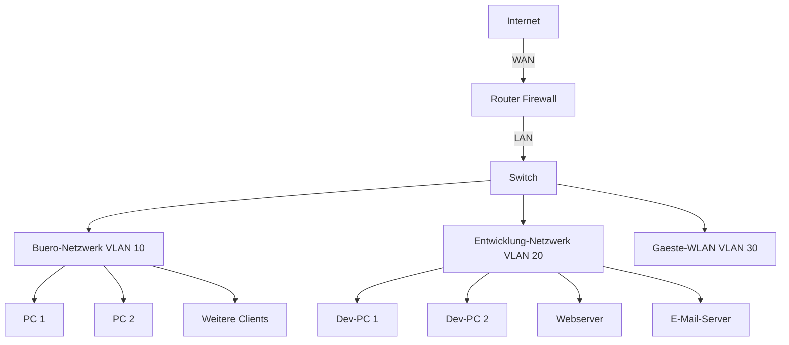

# 🏆 Tag 10: Abschlussprojekt & Reflexion

---

---

## **🎯 Was machst du heute?**

Heute wendest du **alles an, was du gelernt hast**!  
✅ **Ein reales Netzwerk-Szenario** umsetzen.  
✅ **Router, Switches, Firewall, Webserver, E-Mail-Server und Monitoring** kombinieren.  
✅ **Dein Wissen testen** und **Fehler selbst beheben**.  
✅ **Reflektieren**, was du gelernt hast und wo du noch Fragen hast.

**Heute ist dein Tag!** Zeig, was du kannst! 🚀

---

---

---

## **📚 Abschlussprojekt: Netzwerk für ein kleines Unternehmen einrichten**

---

---

### **📌 Szenario: IT-Infrastruktur für "Musterfirma GmbH"**

Die **Musterfirma GmbH** hat folgende Anforderungen:

- **2 Abteilungen:**
  - **Büro (10 Mitarbeiter)** – braucht Zugriff auf das Internet und einen **Webserver**.
  - **Entwicklung (5 Mitarbeiter)** – braucht Zugriff auf das Internet, den Webserver **und einen E-Mail-Server**.
- **1 Webserver** (Apache/Nginx) – soll eine **interne Webseite** hosten.
- **1 E-Mail-Server** (Postfix/Dovecot) – soll **interne E-Mails** ermöglichen.
- **1 Router/Firewall** (Ubuntu-VM) – soll das Netzwerk **schützen** und den **Internetzugriff** ermöglichen.
- **Sicherheit:**
  - **GästewLAN** für Besucher (isoliert vom Hauptnetzwerk).
  - **Firewall-Regeln**, die nur notwendige Ports freigeben.
  - **Monitoring** mit `iftop` oder `nload`, um den Datenverkehr zu überwachen.

---

---

### **📌 Netzwerkplan (Beispiel)**




| **Netzwerk** | **VLAN** | **IP-Bereich**  | **Zweck**                        |
| ------------ | -------- | --------------- | -------------------------------- |
| Büro         | 10       | 192.168.10.0/24 | Mitarbeiter-Netzwerk             |
| Entwicklung  | 20       | 192.168.20.0/24 | Entwicklungsumgebung + Server    |
| GästewLAN    | 30       | 192.168.30.0/24 | Isoliertes Netzwerk für Besucher |


---

---

### **📌 Aufgaben für dein Projekt**

#### **1. Netzwerk einrichten**

- **Erstelle 3 Ubuntu-VMs** (oder nutze eine VM mit mehreren Netzwerkinterfaces):
  - **VM1: Router/Firewall** (mit 3 Netzwerkinterfaces: WAN, LAN-Büro, LAN-Entwicklung, GästewLAN).
  - **VM2: Webserver** (Apache/Nginx).
  - **VM3: E-Mail-Server** (Postfix/Dovecot).

**Hinweis:**

- Falls du nur **eine VM** hast, kannst du **VLANs mit `vlan`-Paketen** simulieren oder **mehrere Netzwerkinterfaces** in VirtualBox einrichten.

---

#### **2. Router/Firewall (VM1) konfigurieren**

- **IP-Forwarding aktivieren**:
  ```bash
  sudo sysctl -w net.ipv4.ip_forward=1
  echo "net.ipv4.ip_forward=1" | sudo tee -a /etc/sysctl.conf
  sudo sysctl -p
  ```
- **NAT für Internetzugriff einrichten**:
  ```bash
  sudo iptables -t nat -A POSTROUTING -o eth0 -j MASQUERADE
  ```
- **Firewall-Regeln für die Netzwerke**:
  ```bash
  # Büro-Netzwerk (VLAN 10): Internet + Webserver
  sudo iptables -A FORWARD -i eth1 -o eth0 -j ACCEPT
  sudo iptables -A FORWARD -i eth0 -o eth1 -m conntrack --ctstate ESTABLISHED,RELATED -j ACCEPT

  # Entwicklung-Netzwerk (VLAN 20): Internet + Webserver + E-Mail-Server
  sudo iptables -A FORWARD -i eth2 -o eth0 -j ACCEPT
  sudo iptables -A FORWARD -i eth0 -o eth2 -m conntrack --ctstate ESTABLISHED,RELATED -j ACCEPT

  # GästewLAN (VLAN 30): Nur Internet
  sudo iptables -A FORWARD -i eth3 -o eth0 -j ACCEPT
  sudo iptables -A FORWARD -i eth0 -o eth3 -m conntrack --ctstate ESTABLISHED,RELATED -j ACCEPT

  # Blockiere Verkehr zwischen den Netzwerken (außer über den Router)
  sudo iptables -A FORWARD -i eth1 -o eth2 -j DROP
  sudo iptables -A FORWARD -i eth2 -o eth1 -j DROP
  sudo iptables -A FORWARD -i eth1 -o eth3 -j DROP
  sudo iptables -A FORWARD -i eth3 -o eth1 -j DROP
  sudo iptables -A FORWARD -i eth2 -o eth3 -j DROP
  sudo iptables -A FORWARD -i eth3 -o eth2 -j DROP
  ```
- **Ports freigeben**:
  ```bash
  # Webserver (Port 80)
  sudo iptables -A FORWARD -i eth0 -o eth2 -p tcp --dport 80 -j ACCEPT
  sudo iptables -A FORWARD -i eth2 -o eth0 -p tcp --sport 80 -j ACCEPT

  # E-Mail-Server (Ports 25, 143, 587)
  sudo iptables -A FORWARD -i eth0 -o eth2 -p tcp --dport 25 -j ACCEPT
  sudo iptables -A FORWARD -i eth2 -o eth0 -p tcp --sport 25 -j ACCEPT
  sudo iptables -A FORWARD -i eth0 -o eth2 -p tcp --dport 143 -j ACCEPT
  sudo iptables -A FORWARD -i eth2 -o eth0 -p tcp --sport 143 -j ACCEPT
  sudo iptables -A FORWARD -i eth0 -o eth2 -p tcp --dport 587 -j ACCEPT
  sudo iptables -A FORWARD -i eth2 -o eth0 -p tcp --sport 587 -j ACCEPT
  ```
- **Regeln speichern**:
  ```bash
  sudo apt install iptables-persistent -y
  sudo netfilter-persistent save
  ```

---

#### **3. Webserver (VM2) einrichten**

- **Apache installieren und starten**:
  ```bash
  sudo apt update
  sudo apt install apache2 -y
  sudo systemctl start apache2
  sudo systemctl enable apache2
  ```
- **Eigene Webseite erstellen**:
  ```bash
  sudo nano /var/www/html/index.html
  ```
  ```html
  <!DOCTYPE html>
  <html>
  <head>
      <title>Musterfirma GmbH</title>
  </head>
  <body>
      <h1>Willkommen bei der Musterfirma GmbH!</h1>
      <p>Das ist die interne Webseite der Firma.</p>
  </body>
  </html>
  ```
- **Port 80 in der Firewall freigeben** (falls nicht schon geschehen):
  ```bash
  sudo ufw allow 80
  ```

---

#### **4. E-Mail-Server (VM3) einrichten**

- **Postfix und Dovecot installieren**:
  ```bash
  sudo apt update
  sudo apt install postfix dovecot-core dovecot-imapd -y
  ```
  - Während der Postfix-Installation: **"Internet Site"** wählen und die Domain `mail.musterfirma.local` eingeben.
- **Postfix starten und aktivieren**:
  ```bash
  sudo systemctl start postfix
  sudo systemctl enable postfix
  ```
- **Dovecot starten und aktivieren**:
  ```bash
  sudo systemctl start dovecot
  sudo systemctl enable dovecot
  ```
- **Benutzer für E-Mails einrichten**:
  ```bash
  sudo adduser devuser
  sudo mkdir -p /home/devuser/Maildir
  sudo chown devuser:devuser /home/devuser/Maildir
  sudo chmod 700 /home/devuser/Maildir
  ```
- **Postfix für lokale E-Mails konfigurieren**:
  ```bash
  sudo nano /etc/postfix/main.cf
  ```
  ```ini
  myhostname = mail.musterfirma.local
  mydomain = musterfirma.local
  myorigin = $mydomain
  inet_interfaces = all
  mydestination = $myhostname, localhost.$mydomain, localhost, $mydomain
  home_mailbox = Maildir/
  ```
  ```bash
  sudo systemctl restart postfix
  ```
- **Firewall-Ports freigeben**:
  ```bash
  sudo ufw allow 25
  sudo ufw allow 143
  sudo ufw allow 587
  ```

---

#### **5. Monitoring einrichten**

- `**iftop` installieren und Datenverkehr beobachten**:
  ```bash
  sudo apt install iftop -y
  sudo iftop
  ```
- `**nload` installieren und Netzwerkauslastung prüfen**:
  ```bash
  sudo apt install nload -y
  nload
  ```

---

---

### **📌 Testaufgaben für dein Projekt**

#### **1. Netzwerkverbindungen prüfen**

- **Pinge von VM1 (Router) zu VM2 (Webserver) und VM3 (E-Mail-Server)**:
  ```bash
  ping 192.168.20.2  # IP von VM2
  ping 192.168.20.3  # IP von VM3
  ```
- **Prüfe, ob die Webseite von VM2 aus dem Büro-Netzwerk (VM1) erreichbar ist**:
  ```bash
  curl http://192.168.20.2
  ```

#### **2. E-Mails testen**

- **Sende eine E-Mail von VM3 an einen Benutzer auf VM3**:
  ```bash
  echo "Hallo, das ist eine Test-E-Mail!" | mail -s "Test-E-Mail" devuser@musterfirma.local
  ```
- **Prüfe die E-Mails von `devuser**`:
  ```bash
  su - devuser
  mail
  ```

#### **3. Firewall-Regeln testen**

- **Versuche, von VM2 (Webserver) auf VM1 (Büro-Netzwerk) zuzugreifen**:
  ```bash
  ping 192.168.10.1
  ```
  - **Erwartet:** **Keine Antwort** (weil die Firewall den Verkehr zwischen den Netzwerken blockiert).

#### **4. Monitoring testen**

- **Starte `iftop` auf VM1 und rufe die Webseite von VM2 auf**:
  ```bash
  sudo iftop
  ```
  - **Erwartet:** Du siehst den **Datenverkehr zwischen VM1 und VM2**.

---

---

---

## **💡 Reflexion: Was hast du gelernt?**

---

---

### **📝 Reflexionsfragen**

1. **Was war das Schwierigste in diesem Kurs?**
2. **Welches Thema hat dir am meisten Spaß gemacht?**
3. **Welche Fähigkeiten hast du verbessert?**
4. **Wo siehst du noch Verbesserungspotenzial?**
5. **Wie würdest du das Gelernte in der Praxis anwenden?**

---

---

### **📝 Feedback zum Kurs**

- **Was hat dir besonders geholfen?**
- **Was war unklar oder zu schwer?**
- **Hast du Vorschläge für Verbesserungen?**

---

---

---

## **🎓 Zusammenfassung: Dein Weg zum Netzwerk-Profi**

---

---

### **📌 Was du in diesem Kurs gelernt hast:**


| **Thema**                 | **Fähigkeiten**                         | **Tools**                   |
| ------------------------- | --------------------------------------- | --------------------------- |
| **Netzwerkgrundlagen**    | OSI-Modell, IP-Adressierung, Subnetting | `ipcalc`                    |
| **Virtualisierung**       | VMs erstellen und konfigurieren         | HyperV                  |
| **Router & Switches**     | Routing, NAT, VLANs                     | `iptables`, `netplan`       |
| **Firewall & Sicherheit** | Firewall-Regeln, Netzwerksegmentierung  | `ufw`, `iptables`           |
| **Webserver**             | Apache/Nginx einrichten, Virtual Hosts  | `apache2`, `nginx`          |
| **E-Mail-Server**         | Postfix/Dovecot einrichten              | `postfix`, `dovecot`        |
| **WLAN**                  | WLAN einrichten und sichern             | `hostapd`, `nmcli`          |
| **Monitoring**            | Datenverkehr analysieren                | Wireshark, `iftop`, `nload` |


