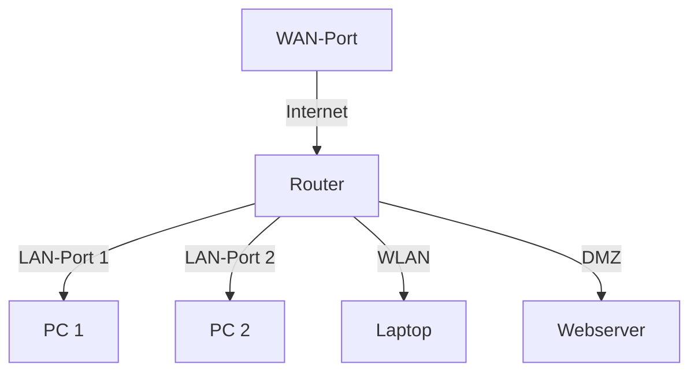

# 🌐 Tag 4: Router & Switches (Wiederholung) + WLAN


## **📖 Theorie**


---

### **1. Router – Das Tor zum Internet und zwischen Netzwerken**

Ein **Router** ist ein **Netzwerkgerät**, das **Datenpakete zwischen verschiedenen Netzwerken weiterleitet**.  
Er arbeitet auf **Schicht 3 (Vermittlungsschicht)** des OSI-Modells und nutzt **IP-Adressen** für das Routing.

#### **Hauptfunktionen eines Routers**


| **Funktion**                          | **Beschreibung**                                                                         |
| ------------------------------------- | ---------------------------------------------------------------------------------------- |
| **Routing**                           | Weiterleitung von Paketen zwischen Netzwerken basierend auf der **Ziel-IP**.             |
| **NAT (Network Address Translation)** | Ermöglicht, dass mehrere Geräte im **privaten Netzwerk** eine **öffentliche IP** teilen. |
| **DHCP-Server**                       | Vergibt **IP-Adressen automatisch** an Geräte im lokalen Netzwerk.                       |
| **Firewall**                          | Filtert Datenverkehr basierend auf **Regeln** (z. B. Ports, IPs).                        |
| **VPN (Virtual Private Network)**     | Ermöglicht sichere **Fernzugriffe** auf ein privates Netzwerk.                           |
| **QoS (Quality of Service)**          | Priorisiert bestimmten Datenverkehr (z. B. VoIP, Video-Streaming).                       |


#### **Aufbau eines Routers**



- **WAN-Port (Wide Area Network):** Verbindung zum **Internet** (z. B. über DSL, Glasfaser).
- **LAN-Ports (Local Area Network):** Verbindung zu **lokalen Geräten** (PCs, Switches).
- **WLAN:** Drahtlose Verbindung für mobile Geräte.
- **DMZ (Demilitarized Zone):** Isoliertes Netzwerk für **öffentlich zugängliche Server** (z. B. Webserver).

---

---

#### **1.1 Router in Linux einrichten**

Ein **Linux-System** kann als **Router** fungieren, indem:

1. **IP-Forwarding aktiviert** wird.
2. **Mehrere Netzwerkinterfaces** konfiguriert werden (z. B. `eth0` für LAN, `eth1` für WAN).
3. **NAT oder Firewall-Regeln** hinzugefügt werden.

##### **Schritt 1: IP-Forwarding aktivieren**

```bash
# Temporär aktivieren (bis zum nächsten Neustart)
sudo sysctl -w net.ipv4.ip_forward=1

# Permanently aktivieren (in /etc/sysctl.conf)
echo "net.ipv4.ip_forward=1" | sudo tee -a /etc/sysctl.conf
sudo sysctl -p
```

##### **Schritt 2: NAT mit `iptables` einrichten**

```bash
# NAT für Ausgehenden Verkehr (z. B. von LAN ins Internet)
sudo iptables -t nat -A POSTROUTING -o eth0 -j MASQUERADE

# Firewall-Regeln speichern (für Ubuntu/Debian)
sudo apt install iptables-persistent -y
sudo netfilter-persistent save
```

##### **Schritt 3: Netzwerkinterfaces konfigurieren**

- **Beispiel:** `eth0` = WAN (Internet), `eth1` = LAN (192.168.1.0/24)
  ```bash
  # Interface eth1 konfigurieren (statische IP)
  sudo nano /etc/netplan/01-netcfg.yaml
  ```
  ```yaml
  network:
    version: 2
    renderer: networkd
    ethernets:
      eth0:
        dhcp4: true  # WAN (DHCP vom ISP)
      eth1:
        addresses: [192.168.1.1/24]  # LAN
  ```
  ```bash
  sudo netplan apply
  ```

---

---

### **2. Switches – Die Vermittler im lokalen Netzwerk**

Ein **Switch** ist ein **Netzwerkgerät**, das **Datenrahmen (Frames)** auf **Schicht 2 (Sicherungsschicht)** des OSI-Modells weiterleitet.  
Im Gegensatz zu einem **Hub** (der Daten an **alle Ports** sendet), lernt ein Switch **MAC-Adressen** und leitet Daten **gezielt** an den richtigen Port weiter.

#### **Funktionsweise eines Switches**

1. **MAC-Adressen lernen:**
    - Der Switch speichert die **MAC-Adresse** eines Geräts, das an einem Port angeschlossen ist.
2. **Frames weiterleiten:**
    - Wenn ein Frame ankommt, prüft der Switch die **Ziel-MAC-Adresse** und leitet den Frame **nur an den Port weiter**, an dem das Zielgerät hängt.
3. **Kollisionen vermeiden:**
    - Jeder Port hat eine **eigene Kollisionsdomäne** (im Gegensatz zu Hubs).

#### **Arten von Switches**


| **Typ**              | **Beschreibung**                                              | **Einsatzzweck**                       |
| -------------------- | ------------------------------------------------------------- | -------------------------------------- |
| **Unmanaged Switch** | Keine Konfiguration möglich, funktioniert "out of the box".   | Kleine Netzwerke (z. B. zu Hause)      |
| **Managed Switch**   | Konfigurierbar (VLANs, QoS, Port-Mirroring, etc.).            | Unternehmensnetzwerke                  |
| **Smart Switch**     | Teilweise konfigurierbar (z. B. VLANs, aber keine volle CLI). | Mittelgroße Netzwerke                  |
| **Layer-3-Switch**   | Kann **Routing** (Schicht 3) durchführen (wie ein Router).    | Große Netzwerke mit hohem Datenverkehr |


#### **VLANs (Virtual Local Area Networks)**

- **Zweck:** Aufteilung eines **physikalischen Netzwerks** in **logische Teilnetze**.
- **Vorteile:**
    - **Sicherheit:** Isolation von Netzwerksegmenten (z. B. Gäste-WLAN vs. Firmennetz).
    - **Performance:** Reduzierung von Broadcast-Domänen.
    - **Flexibilität:** Geräte können **unabhängig vom physikalischen Standort** einem VLAN zugewiesen werden.

##### **VLAN-Tagging (802.1Q)**

- **Tag:** Jeder Frame erhält einen **VLAN-Tag** (4 Byte), der die VLAN-ID enthält.
- **Trunk-Port:** Ein Port, der **mehrere VLANs** transportiert (z. B. zwischen Switches).
- **Access-Port:** Ein Port, der **nur einem VLAN** zugewiesen ist (z. B. für Endgeräte).

---

---

### **3. WLAN – Drahtlose Netzwerke**

**WLAN (Wireless Local Area Network)** ermöglicht die **drahtlose Kommunikation** zwischen Geräten über **Funkfrequenzen**.

#### **WLAN-Standards (IEEE 802.11)**


| **Standard**           | **Jahr** | **Frequenzband** | **Max. Datenrate** | **Reichweite** | **Besonderheiten**                               |
| ---------------------- | -------- | ---------------- | ------------------ | -------------- | ------------------------------------------------ |
| **802.11a**            | 1999     | 5 GHz            | 54 Mbit/s          | ~50 m          | Hohe Störungsanfälligkeit                        |
| **802.11b**            | 1999     | 2.4 GHz          | 11 Mbit/s          | ~100 m         | Langsam, aber weit verbreitet                    |
| **802.11g**            | 2003     | 2.4 GHz          | 54 Mbit/s          | ~100 m         | Kompatibel mit 802.11b                           |
| **802.11n (Wi-Fi 4)**  | 2009     | 2.4/5 GHz        | 600 Mbit/s         | ~250 m         | MIMO (Multiple Input Multiple Output)            |
| **802.11ac (Wi-Fi 5)** | 2013     | 5 GHz            | 3.5 Gbit/s         | ~100 m         | Hohe Datenraten, 5 GHz nur                       |
| **802.11ax (Wi-Fi 6)** | 2019     | 2.4/5 GHz        | 9.6 Gbit/s         | ~100 m         | OFDMA, bessere Performance in dichten Umgebungen |


#### **WLAN-Frequenzbänder**


| **Band**    | **Frequenzbereich** | **Vorteile**                                  | **Nachteile**                                          |
| ----------- | ------------------- | --------------------------------------------- | ------------------------------------------------------ |
| **2.4 GHz** | 2.4–2.4835 GHz      | Große Reichweite, gute Hindernisdurchdringung | Störungsanfällig (Bluetooth, Mikrowellen)              |
| **5 GHz**   | 5.15–5.825 GHz      | Höhere Datenraten, weniger Störungen          | Kürzere Reichweite, schlechtere Hindernisdurchdringung |
| **6 GHz**   | 5.925–6.425 GHz     | Sehr hohe Datenraten, wenig Störungen         | Sehr kurze Reichweite, neue Geräte nötig (Wi-Fi 6E)    |


#### **WLAN-Kanäle**

- **2.4 GHz:** 13 Kanäle (Europa), **überlappend** (nur 3 nicht-überlappende Kanäle: 1, 6, 11).
- **5 GHz:** Bis zu 25 nicht-überlappende Kanäle (je nach Land).
- **Empfehlung:**
  - **2.4 GHz:** Kanal 1, 6 oder 11 verwenden.
  - **5 GHz:** Automatische Kanalauswahl oder manuell einen **freien Kanal** wählen.

---

---

#### **3.1 WLAN-Sicherheit**


| **Sicherheitsstandard**            | **Beschreibung**                                                                   | **Sicherheitslevel** | **Empfehlung**                   |
| ---------------------------------- | ---------------------------------------------------------------------------------- | -------------------- | -------------------------------- |
| **Open (keine Sicherheit)**        | Keine Verschlüsselung, **unsicher**.                                               | ❌ Sehr niedrig       | **Nicht verwenden**              |
| **WEP (Wired Equivalent Privacy)** | Älterer Standard, **leicht zu knacken**.                                           | ❌ Niedrig            | **Nicht verwenden**              |
| **WPA (Wi-Fi Protected Access)**   | Verbesserung von WEP, nutzt **TKIP**.                                              | ⚠️ Mittel            | Nur für ältere Geräte            |
| **WPA2 (AES)**                     | **Sicherster Standard** (bis 2020), nutzt **AES-Verschlüsselung**.                 | ✅ Hoch               | **Empfohlen**                    |
| **WPA3**                           | **Neuester Standard** (ab 2018), verbesserte Sicherheit (z. B. gegen Brute-Force). | ✅✅ Sehr hoch         | **Empfohlen für neue Netzwerke** |


##### **Sicherheitsempfehlungen für WLAN**

1. **Verschlüsselung:**
    - **Mindestens WPA2-AES** verwenden (WPA3, falls verfügbar).
2. **Passwort:**
    - **Langes, komplexes Passwort** (mind. 12 Zeichen, Groß-/Kleinbuchstaben, Zahlen, Sonderzeichen).
    - **Keine einfachen Wörter** (z. B. "Passwort123").
3. **SSID (Netzwerkname):**
    - **Nicht den Router-Hersteller** preisgeben (z. B. nicht "TP-Link_1234").
    - **SSID-Broadcast deaktivieren** (versteckt das Netzwerk, aber keine echte Sicherheit).
4. **MAC-Adressfilterung:**
    - Nur **bestimmte Geräte** (MAC-Adressen) erlauben.
    - **Nachteil:** MAC-Adressen können gefälscht werden.
5. **GästewLAN:**
    - **Isoliertes Netzwerk** für Besucher (kein Zugriff auf das Hauptnetzwerk).
6. **Firewall & Updates:**
    - **Router-Firmware regelmäßig aktualisieren**.
    - **Firewall aktivieren** (z. B. SPI-Firewall).

---

---

#### **3.2 WLAN in Linux einrichten** (Funkioniert leider nicht auf der VM ohne Wlan Stick nicht)

##### **WLAN-Adapter prüfen**

```bash
# Verfügbare Netzwerkinterfaces anzeigen
ip a

# oder
iwconfig
```

- **Beispielausgabe:**
  ```
  wlan0     IEEE 802.11  ESSID:"off/any"
            Mode:Managed  Access Point: Not-Associated
            Retry short limit:7   RTS thr:off   Fragment thr:off
            Power Management:off
  ```

##### **WLAN mit `nmcli` verbinden (NetworkManager)**

```bash
# Verfügbare WLAN-Netzwerke anzeigen
nmcli dev wifi list

# Mit einem Netzwerk verbinden
nmcli dev wifi connect "SSID" password "PASSWORT"

# Verbindung trennen
nmcli dev disconnect wlan0
```

##### **WLAN mit `wpa_supplicant` einrichten (manuell)**

1. **Konfigurationsdatei erstellen:**
  ```bash
   sudo nano /etc/wpa_supplicant/wpa_supplicant.conf
  ```
2. **Verbindung herstellen:**
  ```bash
   sudo wpa_supplicant -B -i wlan0 -c /etc/wpa_supplicant/wpa_supplicant.conf
   sudo dhclient wlan0
  ```

##### **WLAN-Access-Point mit `hostapd` einrichten**

1. `**hostapd` installieren:**
  ```bash
   sudo apt install hostapd -y
  ```
2. **Konfigurationsdatei erstellen:**
  ```bash
   sudo nano /etc/hostapd/hostapd.conf
  ```
3. `**hostapd` starten:**
  ```bash
   sudo systemctl unmask hostapd
   sudo systemctl enable hostapd
   sudo systemctl start hostapd
  ```
4. **IP-Adresse für `wlan0` zuweisen:**
  ```bash
   sudo nano /etc/netplan/01-netcfg.yaml
  ```
5. **DHCP-Server für WLAN einrichten (optional):**
  ```bash
   sudo apt install isc-dhcp-server -y
   sudo nano /etc/dhcp/dhcpd.conf
  ```

---

---

## **💡 Übungsaufgaben**

---

---

### **📝 Aufgabe 1: Router vs. Switch – Was ist der Unterschied?**

Vergleiche **Router** und **Switch** in deinen eigenen Worten.


| **Gerät** | **Wofür ist es da?** | **Arbeitet mit IP Adressen/MAC Adressen** |
| --------- | -------------------- | ------------------- |
| Router    | &nbsp;               | &nbsp;              |
| Switch    | &nbsp;               | &nbsp;              |


??? success "Lösung:"


    | **Gerät** | **Wofür ist es da?** | **Arbeitet mit...** |
    |----------|----------------------|---------------------|
    | Router | **Verbindet verschiedene Netzwerke** (z. B. dein Netzwerk mit dem Internet). | **IP-Adressen** (wie Postleitzahlen). |
    | Switch | **Verbindet Geräte in einem Netzwerk** (z. B. PC + Drucker zu Hause). | **MAC-Adressen** (wie Namenschilder). |


---

---

### **📝 Aufgabe 2: IP-Forwarding aktivieren**

1. Aktiviere **IP-Forwarding** auf deiner Ubuntu-VM.
2. Prüfe, ob es funktioniert.

**Frage:** Warum brauchen wir IP-Forwarding, damit ein Linux-System als Router fungieren kann?

??? success "Lösung:"

    ```bash
    # IP-Forwarding temporär aktivieren
    sudo sysctl -w net.ipv4.ip_forward=1

    # IP-Forwarding dauerhaft aktivieren
    echo "net.ipv4.ip_forward=1" | sudo tee -a /etc/sysctl.conf
    sudo sysctl -p
    ```

    **Prüfen, ob IP-Forwarding aktiv ist:**

    ```bash
    cat /proc/sys/net/ipv4/ip_forward
    ```
    - **Erwartete Ausgabe:** `1` (bedeutet "aktiv").

    **Warum ist IP-Forwarding notwendig?**

      - Ohne IP-Forwarding **leitet deine VM keine Pakete weiter** – sie wirft sie einfach weg.
      - Mit IP-Forwarding **kann deine VM Pakete zwischen Netzwerken weiterleiten** (wie ein Router).
    

---

---

### **📝 Aufgabe 3: NAT einrichten**

Stell dir vor:

- Deine Ubuntu-VM hat **zwei Netzwerk-Karten**:
  - `eth0` = Verbindung zum **Internet**.
  - `eth1` = Verbindung zum **lokalen Netzwerk (192.168.1.0/24)**.

Richte **NAT (Masquerading)** ein, damit Geräte im lokalen Netzwerk über deine VM ins Internet kommen können.

**Frage:** Was macht der Befehl `sudo iptables -t nat -A POSTROUTING -o eth0 -j MASQUERADE`?

??? success "Lösung:"

    
    **Befehl für NAT:**

    ```bash
    sudo iptables -t nat -A POSTROUTING -o eth0 -j MASQUERADE
    ```

    **Was macht der Befehl?**

      - **`MASQUERADE`** = **NAT (Network Address Translation)**.
      - Alle Geräte im **lokalen Netzwerk (192.168.1.0/24)** teilen sich **eine Internet-IP** (die von `eth0`).
      - **Beispiel:** Wenn dein Handy eine Webseite aufruft, sieht das Internet nur die IP deiner VM – nicht die deines Handys.

    **Test:**

      1. Richte eine **zweite VM** mit der IP `192.168.1.2` ein.
      2. Setze das **Gateway** auf `192.168.1.1` (die IP deiner ersten VM).
      3. Versuche, von der zweiten VM aus zu pingen:
      ```bash
      ping 8.8.8.8
      ```
      - **Erwartet:** Es funktioniert! (Die zweite VM kommt ins Internet.)
    

---

---

### **📝 Aufgabe 4: VLANs verstehen**

Ein Unternehmen hat:

- **Abteilung A:** 50 Mitarbeiter
- **Abteilung B:** 30 Mitarbeiter
- **Server:** 10 Server
- **GästewLAN:** 20 Geräte

**Fragen:**

1. Wie viele **VLANs** würdest du einrichten?
2. Welche **IP-Bereiche** würdest du für jedes VLAN nutzen?

??? success "Lösung:"

    
    **1. Anzahl VLANs:**

    - **4 VLANs** (eins pro Abteilung/Netzwerk):
    - VLAN 10: Abteilung A
    - VLAN 20: Abteilung B
    - VLAN 30: Server
    - VLAN 40: GästewLAN

    **2. IP-Bereiche:**

    | **VLAN** | **Netzwerk** | **Beispiel-IPs** |
    |---------|-------------|----------------|
    | VLAN 10 | 192.168.10.0/24 | 192.168.10.1 – 192.168.10.254 |
    | VLAN 20 | 192.168.20.0/24 | 192.168.20.1 – 192.168.20.254 |
    | VLAN 30 | 192.168.30.0/24 | 192.168.30.1 – 192.168.30.254 |
    | VLAN 40 | 192.168.40.0/24 | 192.168.40.1 – 192.168.40.254 |

    **Warum?**

      - Jedes VLAN hat seinen **eigenen IP-Bereich**.
      - Geräte aus **VLAN 10** können **nicht direkt** mit Geräten aus **VLAN 20** kommunizieren (außer über einen Router).
        

---

---

### **📝 Aufgabe 5: WLAN-Sicherheit prüfen**

Ein Unternehmen nutzt:

- **WEP-Verschlüsselung**
- **Passwort: "Company123"**

**Fragen:**

1. Welche **Probleme** gibt es hier?
2. Wie kann man das WLAN **sicherer machen?** (Nenne 3 Dinge.)

??? success "Lösung:"

    
    **1. Probleme:**

    - **WEP ist unsicher** → kann leicht geknackt werden.
    - **Passwort ist zu einfach** → kann leicht erraten werden.

    **2. Verbesserungen:**

      - ✅ **WPA2 oder WPA3 nutzen** (statt WEP).
      - ✅ **Starkes Passwort** (z. B. `Sicher3sWLAN!2026`).
      - ✅ **GästewLAN einrichten** (damit Besucher nicht ins Hauptnetzwerk kommen).
    

---

---

### **📝 Aufgabe 6: WLAN in Linux verbinden**

1. Prüfe, ob deine Ubuntu-VM einen **WLAN-Adapter** hat.
2. Verbinde dich mit einem **WLAN-Netzwerk** (z. B. deinem Handy-Hotspot).

**Frage:** Wie prüfst du, ob die Verbindung funktioniert?

??? success "Lösung:"

    
    **Befehle:**

    ```bash
    # WLAN-Adapter prüfen
    iwconfig

    # Verfügbare Netzwerke anzeigen
    nmcli dev wifi list

    # Mit WLAN verbinden
    nmcli dev wifi connect "DEIN_WLAN_NAME" password "DEIN_PASSWORT"
    ```

    **Verbindung prüfen:**

    ```bash
    # IP-Adresse anzeigen
    ip a show wlan0

    # Ping-Test
    ping 8.8.8.8
    ```
    - **Erwartet:**

      - `ip a` zeigt eine **IP-Adresse** (z. B. `192.168.1.100`).
      - `ping 8.8.8.8` gibt **Antworten** zurück.
  


---

---

## **🎓 Zusammenfassung**

- **Router** leiten **Daten zwischen Netzwerken** weiter (Schicht 3, IP-Adressen).
- **Switches** leiten **Frames innerhalb eines Netzwerks** weiter (Schicht 2, MAC-Adressen).
- **VLANs** ermöglichen die **logische Aufteilung** eines physikalischen Netzwerks.
- **WLAN** ermöglicht **drahtlose Kommunikation** über Funkfrequenzen (2.4 GHz, 5 GHz, 6 GHz).
- **WLAN-Sicherheit:**
  - **WPA2/WPA3** verwenden (kein WEP!).
  - **Komplexe Passwörter** und **regelmäßige Updates**.
  - **GästewLAN** und **VLANs** für Isolation nutzen.
- **Linux als Router:**
  - **IP-Forwarding** aktivieren.
  - **NAT mit `iptables**` einrichten.
- **WLAN in Linux:**
  - `**nmcli**` für einfache Verbindungen.
  - `**hostapd**` für Access-Points.


